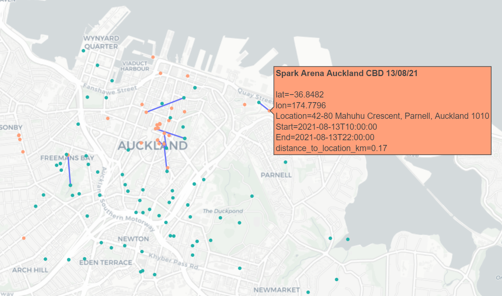
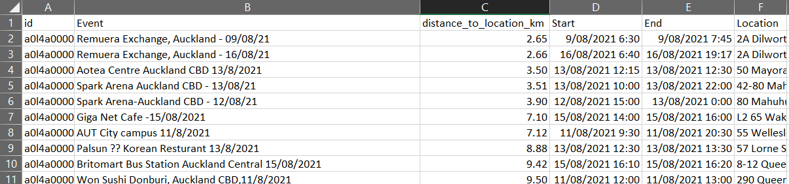

# Location of Interest Checker

Script to compare COVID locations of interest to Google location history.

The script produces a map plot (as shown below) as well `.csv` file for further inspection of the data.


**Figure:** Output plot from checker script. Orange points are locations of interest, green points are personal locations at corresponding times. Blue lines show the 10 locations of interest you were closest to.


**Figure:** Output `.csv` checker script, visualised in Excel. Column `distance_to_location_km` shows how far in km you were from the given location of interest.

*NOTE* see [health.govt.nz](https://www.health.govt.nz/our-work/diseases-and-conditions/covid-19-novel-coronavirus/covid-19-health-advice-public/contact-tracing-covid-19/covid-19-contact-tracing-locations-interest) for the official list of locations of interest, and guidance on what to do if you have been at one.

## Usage

### Export Google location history

1) Go to https://takeout.google.com/
2) Under 'CREATE A NEW EXPORT`, deselect all, then select 'Location History', then 'Next Step'
3) Follow instructions to download, then unzip exported data. This tool uses the file 'Location History.json'

### Install

To install this package into a virtualenv:

```bash
python -m venv venv
source venv/bin/activate
pip install git+https://github.com/tim-fan/location_of_interest_checker.git
```


### Run 

Run the checker script. See the `-h` flag for usage. 
```text
$ location_of_interest_checker -h
Locations of Interest Checker.

Check current New Zealand COVID locations of interest against exported Google location history.

Input arguments are the path to the exported location history json, and the file underwhich
to save the results of the check.

The output csv contains a list of all locations of interest, along with a column specifying how
far (in km) you were from that location at that time. If any distances are less
than, say 0.1km, you should probably get a test and self isolate!

See https://www.health.govt.nz/our-work/diseases-and-conditions/covid-19-novel-coronavirus/covid-19-health-advice-public/contact-tracing-covid-19/covid-19-contact-tracing-locations-interest
for official list of locations of interest, and instructions on what to do if you have been at one.

Usage:
  location_of_interest_checker <location_history_file> <output_csv>

Options:
  -h --help     Show this screen.
```

For example, if your exported history file is saved as `Location History.json`;
```bash
location_of_interest_checker Location\ History.json /tmp/results.csv
```
On completion, the file `/tmp/results.csv` can be opened in Excel or similar tools for inspection.

See the column `distance_to_location_km` to see how close you were to the locations of interest.


## TODO

* Think about packaging/distribution so this can easily be used by non-python users
* Improvements to the plot: 
    * Better show the association between history points and interest points
    * Better hover text
    * Add a legend
    * Color lines by distance
    * WWidgets for filtering by distance, time etc.
* Look into connecting directly to Google API to extract location history, rather than requiring manual export.
* Better configurability:
    * support different timezones? Different source datasets?
    * support different filtering start-times
    * flags to enable/disable plotting and .csv export